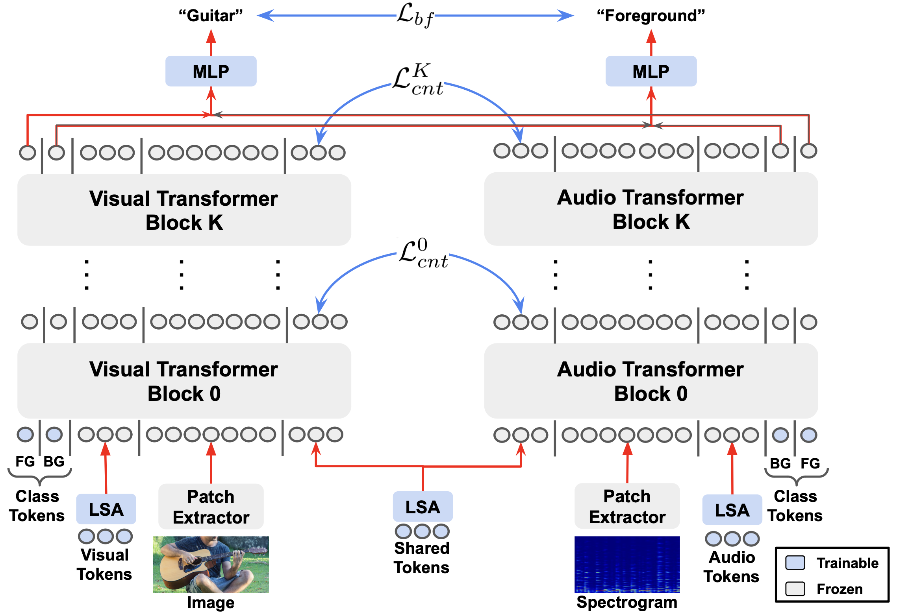

**[MA-AVT: Modality Alignment for Parameter-Efficient Audio-Visual Transformers (CVPRW 2024, Oral)](https://arxiv.org/abs/2406.04930)**
<br/>
[Tanvir Mahmud](https://sites.google.com/view/tanvirmahmud),
[Shentong Mo](https://scholar.google.com/citations?user=6aYncPAAAAAJ&hl=en),
[Yapeng Tian](https://www.yapengtian.com/),
[Diana Marculescu](https://www.ece.utexas.edu/people/faculty/diana-marculescu)
<br/>


MA-AVT is a new parameter-efficient audio-visual transformer employing deep modality alignment for multimodal semantic feature correspondence.


<div align="center">
  
</div>


## Environment

To setup the environment, please simply run

```
pip install -r requirements.txt
```


## Datasets

###  AVE

Data can be downloaded from [Audio-visual event localization in unconstrained videos](https://sites.google.com/view/audiovisualresearch)

###  VGGSound

Data can be downloaded from [Vggsound: A large-scale audio-visual dataset](https://www.robots.ox.ac.uk/~vgg/data/vggsound/)

###  CREMA-D

Data can be downloaded from [CREMA-D: Crowd-sourced emotional multimodal actors dataset](https://github.com/CheyneyComputerScience/CREMA-D)


## Train

For training the MA-AVT model, please run

```python 
        python train_avm_vit.py --id MA-AVT --dataset vggsound \
                --data_dir /path/to/LAVISH/data/VGGSound --batch_size 256 --epochs 50 \
                --num_class 309 --output_dir /path/to/outputs/ --fps 1 --lr 0.01 \
                --lr_step 15 --mode train --model ma_avt --vis_encoder_type vit \
                --vit_type base --pretrained --multiprocessing_distributed --ngpu 4 \
                --LSA --print_freq 10 --num_vis 24 --n_audio_tokens 5 --n_vis_tokens 5 \
                --n_shared_tokens 5 --bg_label -1 --bg_cls --bg_prob 0.2 --unimodal_token \
                --multimodal_token --contrastive blockwise_sep --port 23145
```

## Test

For testing and visualization, simply run

```python
      python train_avm_vit.py --id MA-AVT --dataset vggsound \
                --data_dir /path/to/LAVISH/data/VGGSound --batch_size 256 --epochs 50 \
                --num_class 309 --output_dir /path/to/outputs/ --fps 1 --lr 0.01 \
                --lr_step 15 --mode test --model ma_avt --vis_encoder_type vit \
                --vit_type base --pretrained --multiprocessing_distributed --ngpu 4 \
                --LSA --print_freq 10 --num_vis 24 --n_audio_tokens 5 --n_vis_tokens 5 \
                --n_shared_tokens 5 --bg_label -1 --bg_cls --bg_prob 0.2 --unimodal_token \
                --multimodal_token --contrastive blockwise_sep --port 23145
```

## 👍 Acknowledgments
This codebase is based on [LAVISH](https://github.com/GenjiB/LAVISH) and [OGM-GE](https://github.com/GeWu-Lab/OGM-GE_CVPR2022). Thanks for their amazing works.

## LICENSE
MA-AVT is licensed under a [UT Austin Research LICENSE](./LICENSE).


## Citation
If you find this work useful, please consider citing our paper:

### BibTeX
```bibtex
@misc{mahmud2024maavt,
      title={MA-AVT: Modality Alignment for Parameter-Efficient Audio-Visual Transformers}, 
      author={Tanvir Mahmud and Shentong Mo and Yapeng Tian and Diana Marculescu},
      year={2024},
      eprint={2406.04930},
      archivePrefix={arXiv}
  }